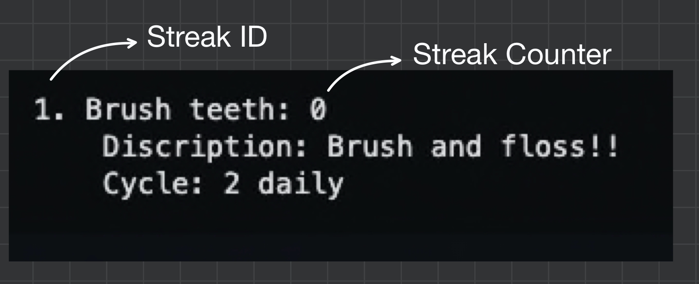

# Command Line Streaks App 👨‍💻
This app is inspired by the [Streaks App](https://apps.apple.com/ca/app/streaks/id963034692). My app uses Java to operate on the command line and only implements the bare minimum functionality.

## Installation 🔧

## Commands 🤖

`list` enumerates all the current streaks the user has saved.

Example output:

> The *Streak ID* can be used to manipulate the streak and the *Streak Counter* is used to keep track of how many times the habit was repeated in a row. 

`add` initializes a program that will walk the user through adding a habit to the app.

`remove <id>` completely deletes the streak given the streak id

`remove <name>` completely deletes the streak given the streak name

`in <id>` increments the streak by one given the streak id

`in <name>` increments the streak by one given the streak name

`report` gives a report on the status of all the streaks